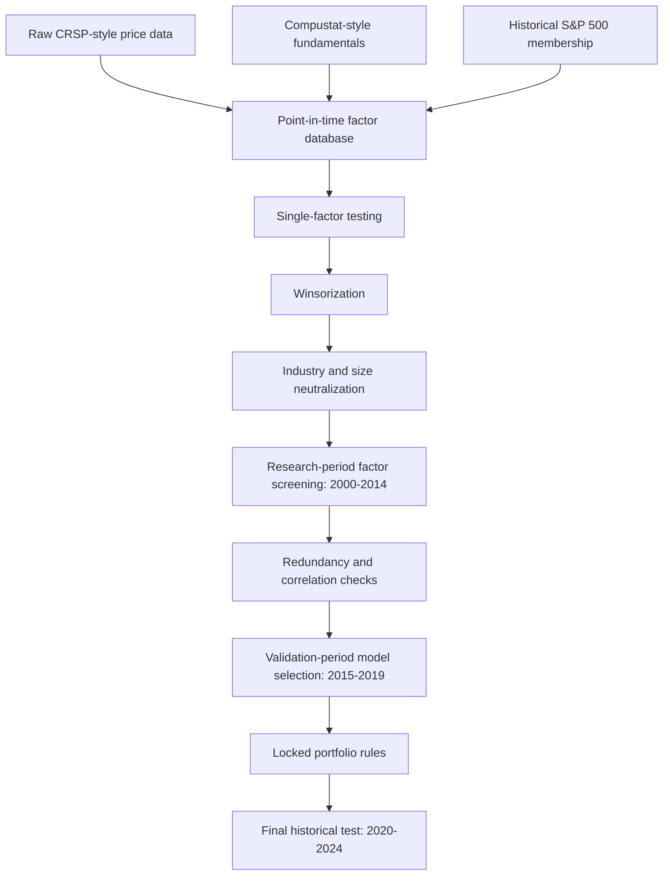

# S&P 500 Multi-Factor Stock Selection Research

This project is a research-oriented S&P 500 multi-factor stock selection system. It builds a point-in-time monthly factor database, tests individual factors, applies industry and size neutralization, separates research / validation / test periods, and runs a locked final portfolio backtest with transaction costs.

The goal is not to claim a production-ready trading strategy. The goal is to demonstrate a complete and honest quantitative research workflow.

## Project Summary

- Universe: historical S&P 500 constituents, 2000–2024.
- Data: CRSP-style monthly stock returns and Compustat-style quarterly fundamentals.
- Frequency: monthly signals and next-month returns.
- Main model: two-factor long-only stock selection model using `accruals` and `cfo_roa`.
- Research period: 2000–2014.
- Validation period: 2015–2019.
- Locked historical test period: 2020–2024.
- Portfolio: top 100 stocks, equal-weighted, monthly rebalanced.
- Transaction cost assumption: 10 bps one-way.

## Key Results

Final locked historical test, 2020–2024:

| Metric | Result |
|---|---:|
| Annual return | 14.89% |
| Benchmark annual return | 14.93% |
| Annual volatility | 20.77% |
| Sharpe ratio, zero risk-free rate | 0.72 |
| Maximum drawdown | -21.52% |
| Positive month ratio | 62.71% |
| Average monthly turnover | 11.58% |
| Annualized transaction cost | 0.14% |
| Information ratio | 0.07 |

The locked strategy performed close to the benchmark, but it did not produce statistically meaningful alpha after costs. This is still a useful research outcome: the pipeline avoids many common beginner mistakes such as look-ahead bias, static-universe bias, and unrestricted test-set tuning.

## Research Pipeline



## Repository Contents

Important scripts:

- `build_sp500_factor_database.py`: builds the monthly point-in-time factor panel.
- `run_single_factor_tests.py`: first-stage single-factor detector.
- `factor_detector_v2.py`: stricter detector with winsorization, neutralization, FDR correction, validation, and locked candidates.
- `validate_portfolio_rules.py`: validates portfolio construction choices on 2015–2019.
- `run_locked_final_test.py`: runs the locked final 2020–2024 historical test.

Documentation:

- `docs/methodology.md`: full research methodology.
- `docs/data_dictionary.md`: data fields and factor definitions.
- `docs/project_report.md`: readable project report.
- `docs/limitations.md`: important limitations and disclosure.

Selected outputs:

- `factor_database/reports/quality_summary.json`
- `factor_detector_v2/README.md`
- `portfolio_validation/validation_portfolio_summary.csv`
- `locked_final_test/final_test_report.md`
- `locked_final_test/final_test_results.json`

## Data Disclosure

The raw CRSP / Compustat / WRDS data and generated Parquet factor databases are not included in this public repository because they may be licensed and too large for GitHub. The repository includes code, methodology, and small result summaries only.

To reproduce the project, place the required raw data locally and run the scripts in the order described below.

## How to Run

Install dependencies:

```bash
pip install -r requirements.txt
```

Suggested order:

```bash
python build_sp500_factor_database.py
python run_single_factor_tests.py --all
python factor_detector_v2.py
python validate_portfolio_rules.py
python run_locked_final_test.py
```

Depending on local file locations, the scripts may require path adjustments for raw input data.

## What This Project Shows

This project demonstrates:

- Building a point-in-time research dataset.
- Handling dynamic historical index membership.
- Constructing price-based and fundamental factors.
- Testing factors with Rank IC, ICIR, Newey-West statistics, quantile returns, and transaction costs.
- Applying industry and size neutralization.
- Avoiding excessive data mining through research / validation / test separation.
- Reporting negative or inconclusive results honestly.

## Suggested Resume Description

Built a point-in-time S&P 500 multi-factor stock selection research system using CRSP-style monthly returns and Compustat-style fundamentals. Implemented dynamic universe construction, factor database generation, Rank IC testing, industry and size neutralization, FDR multiple-testing correction, validation-period model selection, transaction-cost-aware portfolio backtesting, and locked 2020–2024 historical evaluation.

